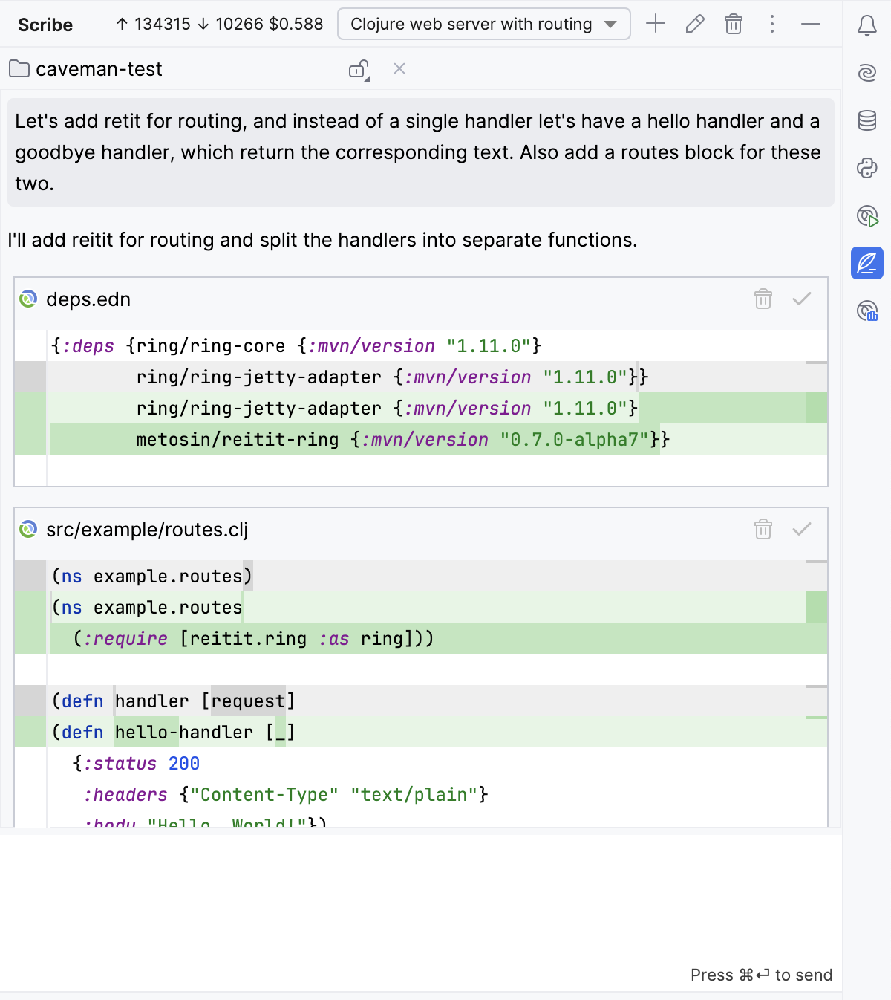

# Caveman tutorial

This is a little test to see how well Claude Sonnet 3.5 (the newer 20241022 version) performs creating the 
[Caveman tutorial](https://caveman.mccue.dev). It basically nailed it perfectly. Obviously the main point of a tutorial 
like this is to do it yourself and learn, but it was an interesting test. And while the code is simple, Claude managed
to make changes to multiple files consistently, and make up to 8 changes in a single reply. I think this tutorial is 
pretty new, so it's unlikely Claude just copied it out of its training data.

I only did the first half of the tutorial, because I didn't feel like standing up a database.

The full transcript is [here](https://gist.github.com/cursive-ide/6b688462bc3e52f4702e093f4fcfd00c). The funny 
search/replace blocks are a tidied up form of the diff format my tool requests Claude return, it looks like this in 
the IDE:

